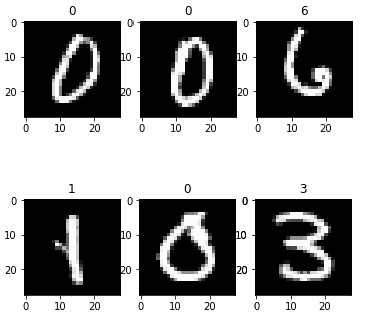

<h1 style="text-align:center">OCR - Linear Neural Network From Scratch</h1>


The task is to classify a given image of a handwritten digit into one of 10 classes representing integer values from 0 to 9, inclusively.
The MNIST handwritten digit classification problem is a standard dataset used in computer vision and deep learning.

Although the MNIST dataset is effectively solved, it can be a useful starting point for developing and practicing a methodology for solving image classification tasks using neural networks.

Instead of reviewing the literature on well-performing models on the dataset, we can develop a new model from scratch.

## Prerequisites
You need to install TensorFlow 1.13.1 and Keras module 
- Installing TensorFlow with conda 
    
```console
    $ conda create -n tensorflow  python=3.5
    $ activate tensorflow
    $ pip install --ignore-installed --upgrade tensorflow
```
- Installing Keras
 ```console
    $ pip install keras
```

## DataSet 
The MNIST dataset is an acronym that stands for the Modified National Institute of Standards and Technology dataset.

It is a dataset of 60,000 small square 28×28 pixel grayscale images of handwritten single digits between 0 and 9.

## Model 
We implemented a linear neural network classifier  with no hidden layer for the sake of simplicty . 
The model is implemented from scratch using ```numpy``` , all the  mathematical justification and formulas are included in the notebook. 

## Results 

The performance of the linear classifier is quite good (since it is only linear) we achieve :
- Train Accuracy :  89.64%
- Validation Accuracy:  89.24%
- Prediction exemple




## To Do : 
Since this dataset is already solved with 99% accuracy , one way to increase the accuracy is that  we  may increase the number of trainable parameters thus including some hidden layers or toggle from linear classifers to Convulutional  classifer . 
``` Check this [link]() ```
